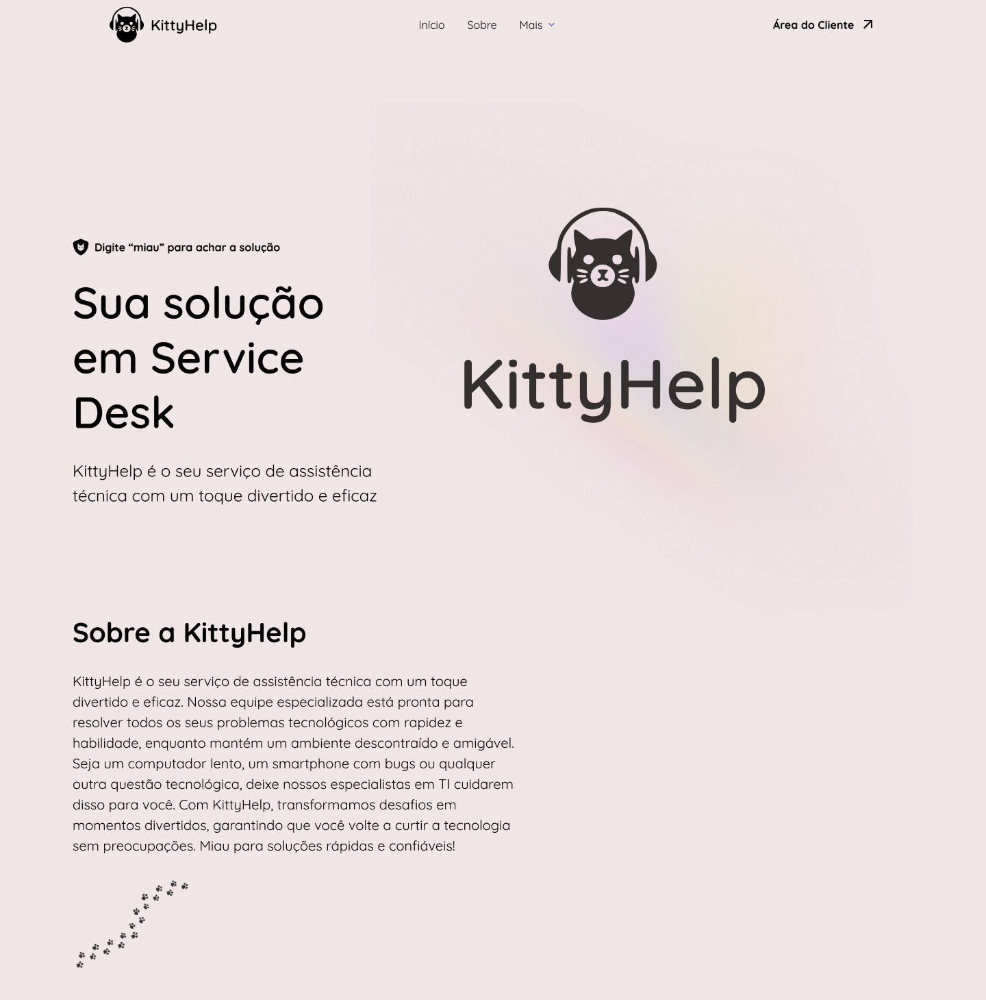

# Sistema de Gestão de Chamados - KittyHelp

<div align="center">
    
</div>


## Descrição

Este projeto é um sistema de gestão de chamados desenvolvido para o Bootcamp da SoulCode Academy & PagBank, concebido para facilitar a administração e o atendimento de chamados dentro de uma organização. Ele permite que usuários registrem chamados e que técnicos os atendam de forma eficiente. Este README fornece uma visão geral das funcionalidades do sistema, bem como instruções básicas para sua utilização e desenvolvimento.




## Telas

### Tela Inicial

- **Descrição**: A tela inicial oferece uma introdução ao sistema, explicando seu propósito e como usá-lo.
- **Funcionalidades**:
    - Breve descrição do sistema.
    - Links para login e registro de novos usuários e técnicos.

### Tela de Login

- **Descrição**: Tela para autenticação de usuários e técnicos.
- **Funcionalidades**:
    - Formulário de login.
    - Opção para novos usuários e técnicos se cadastrarem.
    - Verificação de credenciais através de MySQL.

### Tela do Usuário

- **Descrição**: Após o login, os usuários podem gerenciar seus chamados.
- **Funcionalidades**:
    - Visualizar chamados anteriores.
    - Criar novos chamados.
    - Visualização de detalhes dos chamados, como usuário, setor, descrição, prioridade e data de início.

### Tela do Técnico

- **Descrição**: Tela onde os técnicos podem visualizar e gerenciar os chamados atribuídos.
- **Funcionalidades**:
    - Visualizar chamados disponíveis e atribuídos.
    - Alterar o status dos chamados (Aguardando técnico, Em atendimento, Escalado para outro setor, Finalizado).

### Tela de Administrador

- **Descrição**: Painel administrativo para gerenciamento do sistema.
- **Funcionalidades**:
    - Visão geral do sistema (chamados em aberto, em execução, aguardando).
    - Gerenciamento de setores da empresa e tipos de prioridade.

## Especificações Técnicas

- **Linguagem de Programação**: Java com Spring Boot.
- **Arquitetura**: MVC & Programação Orientada a Objetos.
- **Front-end**: HTML, CSS, ThymeLeaf e Bulma.
- **Banco de Dados**: MySQL.
- **Controle de Versão**: GitHub.
- **API**: RESTful.

## Configuração e Instalação

Instruções detalhadas sobre como configurar e executar o sistema localmente.

```bash
# Clonar o repositório
git clone [URL do repositório]
cd [nome do diretório]

# Instalar dependências
./gradlew build

# Executar o aplicativo
./gradlew bootRun

```
## Desenvolvedoras

- [Anna Paula](https://www.linkedin.com/in/annapaula-marques/)

- [Angel Diniz](https://www.linkedin.com/in/angel-d-9764a1127/)

- [Bianca Leal](https://www.linkedin.com/in/bianca-leall/)

- [Nicole brito](https://www.linkedin.com/in/nicolebrito/)

- [Rayla Fernanda](https://www.linkedin.com/in/rayla-fernanda-405153215/)


## Licença

[MIT](https://choosealicense.com/licenses/mit/)
